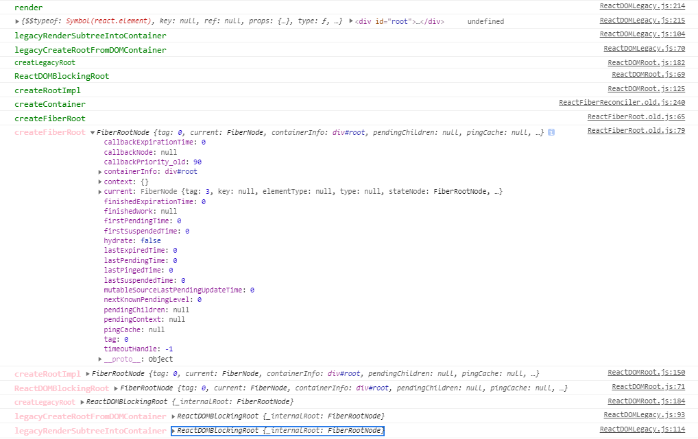
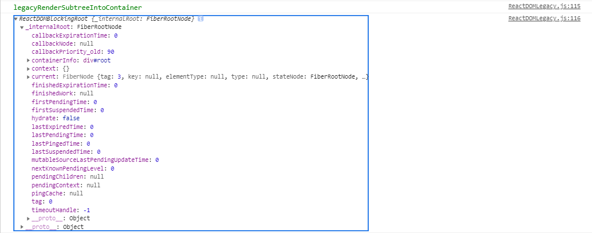

## ReactDom.render
1. 创建更新方式
- ReactDom.render
- setState
- forceUpdate

### Render
- 创建ReactRoot
- 创建FiberRoot和RootFiber
- 创建更新
- 进入更新调度阶段

### 代码
1. 首先执行ReactDom.render函数
```
// 传入参数：reactElement，挂载Dom节点，回调函数渲染结束后调用
export function render(
  element: React$Element<any>,
  container: Container,
  callback: ?Function,
) {
  console.log('%crender', 'font-size:14px;color:green;');
  console.log(element, container, callback);
  return legacyRenderSubtreeIntoContainer(
    null,
    element,
    container,
    false, // 服务端渲染时时候是否复用dom节点，与客户端渲染的区别，hydrate传入的就是true，唯一区别
    callback,
  );
}
```
2. 调用legacyRenderSubtreeIntoContainer返回reactRoot，也就是函数里的container._reactRootContainer，首次渲染是没有这个属性的
通过legacyCreateRootFromDOMContainer生成返回，fiberRoot是通过root._internalRoot属性得到的
```
function legacyRenderSubtreeIntoContainer(
  parentComponent: ?React$Component<any, any>, // null
  children: ReactNodeList, // 
  container: Container,
  forceHydrate: boolean,
  callback: ?Function,
) {
  let root: RootType = (container._reactRootContainer: any);
  let fiberRoot;
  if (!root) {
    root = container._reactRootContainer = legacyCreateRootFromDOMContainer(
      container,
      forceHydrate,
    );
    fiberRoot = root._internalRoot;
    // 省略回调函数部分逻辑判断
    unbatchedUpdates(() => {
      updateContainer(children, fiberRoot, parentComponent, callback);
    });
  } else {
    fiberRoot = root._internalRoot;
    if (typeof callback === 'function') {
      const originalCallback = callback;
      callback = function() {
        const instance = getPublicRootInstance(fiberRoot);
        originalCallback.call(instance);
      };
    }
    // Update
    updateContainer(children, fiberRoot, parentComponent, callback);
  }
  return getPublicRootInstance(fiberRoot);
}
```
3. legacyCreateRootFromDOMContainer 创建ReactRoot
```
function legacyCreateRootFromDOMContainer(
  container: Container,
  forceHydrate: boolean, // false, hydrate传过来是true，是否需要调和子节点，服务端服用节点，节省性能
): RootType {
  
  const shouldHydrate =
    forceHydrate || shouldHydrateDueToLegacyHeuristic(container); // false
  // First clear any existing content.
  // 删除所有子节点
  if (!shouldHydrate) {
    let warned = false;
    let rootSibling;
    // 循环操作删除所有子节点
    while ((rootSibling = container.lastChild)) {
      container.removeChild(rootSibling);
    }
  }
  // 创建ReactRoot
  return createLegacyRoot(
    container,
    shouldHydrate
      ? {
          hydrate: true,
        }
      : undefined,
  );
}
```
4. createLegacyRoot函数返回 new ReactDOMBlockingRoot
5. ReactDOMBlockingRoot实例化后有个_internalRoot属性，这个属性就是2中的fiberRoot
```
function ReactDOMBlockingRoot(
  container: Container,
  tag: RootTag,
  options: void | RootOptions,
) {
  console.log('%cReactDOMBlockingRoot', 'font-size:14px;color:green;');
  this._internalRoot = createRootImpl(container, tag, options);
  console.log('%cReactDOMBlockingRoot', 'font-size:14px;color:pink;', this._internalRoot);
}
```
6. createRootImpl返回一个root，这个root是通过createContainer创建返回的
7. createContainer调用createFiberRoot函数返回一个对象
8. createFiberRoot
```
export function createFiberRoot(
  containerInfo: any,
  tag: RootTag,
  hydrate: boolean,
  hydrationCallbacks: null | SuspenseHydrationCallbacks,
): FiberRoot {
  console.log('%ccreateFiberRoot', 'font-size:14px;color:green;');
  const root: FiberRoot = (new FiberRootNode(containerInfo, tag, hydrate): any);
  const uninitializedFiber = createHostRootFiber(tag);
  root.current = uninitializedFiber;
  uninitializedFiber.stateNode = root;

  initializeUpdateQueue(uninitializedFiber);
  
  console.log('%ccreateFiberRoot', 'font-size:14px;color:pink;', root);
  return root;
}
```
这个函数就比较重要了，这里就可以看到，其实上面那个container._reactRootContainer = { _internalRoot: XXXX }中的这个XXXX，其实就是这个createFiberRoot里return的这个root
换句话说，所谓的“ReactRoot”其实就是一个对象，这个对象有个 _internalRoot 属性，这个_internalRoot属性，就是一个“FiberRoot”，这个FiberRoot是整个应用的一个起点，包含应用挂载的目标节点，记录整个应用更新过程中的各种信息
这里可以看下FiberRoot这个对象的结构，后面有些属性干嘛的，会慢慢更新；
```
function FiberRootNode(containerInfo, tag, hydrate) {
  this.tag = tag; // FiberRoot的标识，0
  this.current = null; // 指向RootFiber，当前应用对应的Fiber对象
  this.containerInfo = containerInfo; // ReactDom.render第二个参数
  this.pendingChildren = null; // 持久化更新中用到，react-dom中用不到
  this.pingCache = null;
  this.finishedExpirationTime = NoWork;
  this.finishedWork = null; // 最终会生成的fiber树，也就是最终的workInProgress树
  this.timeoutHandle = noTimeout; // 
  this.context = null; // 顶层context对象，只有主动调用renderSubtreeIntoContainer时才会有用，用不到
  this.pendingContext = null;
  this.hydrate = hydrate; // ssr相关
  this.callbackNode = null;
  this.callbackPriority_old = NoPriority;
  this.firstPendingTime = NoWork;
  this.lastPendingTime = NoWork;
  this.firstSuspendedTime = NoWork;
  this.lastSuspendedTime = NoWork;
  this.nextKnownPendingLevel = NoWork;
  this.lastPingedTime = NoWork;
  this.lastExpiredTime = NoWork;
  this.mutableSourceLastPendingUpdateTime = NoWork;

  if (enableSchedulerTracing) {
    this.interactionThreadID = unstable_getThreadID();
    this.memoizedInteractions = new Set();
    this.pendingInteractionMap_old = new Map();
  }
  if (enableSuspenseCallback) {
    this.hydrationCallbacks = null;
  }
}
```
回头继续看createFiberRoot方法，这里还调用了createHostRootFiber,生成一个未初始化的Fiber节点，就是RootFiber，root的current就是指向这里,同时该RootFiber的stateNode又指向了root。
```
const uninitializedFiber = createHostRootFiber(tag);
  root.current = uninitializedFiber;
  uninitializedFiber.stateNode = root;
```
9. createHostRootFiber会判断react的各种模式，但是这里是初次渲染就是NoMode，然后返回一个实例化的 new FiberNode。也就是说这个fiber对象就是第一个"RootFiber"
10. createFiber创建fiber的一个工厂，每个fiber数据结构来看看有什么吧。每一个ReactElement对应一个Fiber对象，用来记录节点的各种状态，串联整个应用形成树结构
```
function FiberNode(
  tag: WorkTag,
  pendingProps: mixed,
  key: null | string,
  mode: TypeOfMode,
) {
  // Instance
  this.tag = tag; // 标记不同组件类型，如classComponent表示class类组件 functionComponent表示函数类型组件 还有其他类型的在 ReactWorkTag.js 文件红可以看到，具体类型直接全局搜索WorkTag，有个Map映射关系
  this.key = key; // react元素上的key 就是jsx上写的那个key
  this.elementType = null; // 表示fiber的真实类型 比如当前fiber对应的jsx是div 那这个属性就是 'div' 如果这个属性对应一个叫做 Test 的class类 那么这个属性就是 Test 本身
  this.type = null; // 表示fiber的真实类型 这个和elementType大部分情况下是一样的 在使用了懒加载之类的功能时可能会不一样
  this.stateNode = null; // 当前Fiber对应的实例 比如class组件 new完之后就挂在这个属性上

  // Fiber
  this.return = null; // 用来指向当前fiber的父fiber
  this.child = null; // 子级Fiber 指向自己的第一个子Fiber节点 也就是firstChildFiber
  this.sibling = null; // 兄弟节点 指向右边的兄弟节点,在react中采用的是树和链表数据结构，每个节点有且仅有一个child指向firstchild，sibling同理
  this.index = 0; // 一般如果没有兄弟节点的话是0 当某个父节点下的子节点是数组类型的时候会给每个子节点一个index index和key要一起做diff

  this.ref = null; // 这个就是react元素上也就是jsx上写的ref

  this.pendingProps = pendingProps; // 新传进来的props
  this.memoizedProps = null; // 上次渲染完后的旧的props
  this.updateQueue = null; // 该fiber上的更新队列 执行一次setState就会往这个属性上挂一个新的更新 这些更新以链表的形式存在
  this.memoizedState = null; // 旧的state 也表示当前页面上的你能看到的状态 不只是class组件有 function类型组件也可能有
  this.dependencies_old = null;

  this.mode = mode;

  // Effects 副作用，标记dom节点需要执行哪些更新，标记组件生命周期
  this.effectTag = NoEffect; // 表示当前fiber要进行何种更新 ReactSideEffectTag.js 文件中可以看到全部更新类型 比如placement表示是新创建的节点 update表示属性可能有变化或者有生命周期之类，没有更新就是NoEffect
  this.nextEffect = null; // 一条链表 指向下一个有更新的fiber

  this.firstEffect = null; // 子节点中所有有更新的节点中的第一个fiber
  this.lastEffect = null; // 子节点中所有有更新的节点中的最后一个fiber

  this.expirationTime = NoWork; // 当前fiber的优先级 也可以说是过期时间，同步状态下用不到，也就是说如果不给组件包裹concurrent组件的话 几乎没太大用
  this.childExpirationTime = NoWork; // 当前节点的所有子节点中的那个最大的优先级

  this.alternate = null; // 指向当前fiber的上一个状态 double buff current <==> workInProgress

  // 文本类型节点比较特殊，如果文本类型没有兄弟节点，不生成fiber，或者说fiber是null，其他类型的节点不管是class还是function都会生成对应的fiber
  // 下面这些是记录节点渲染时间信息
  if (enableProfilerTimer) {
    this.actualDuration = Number.NaN;
    this.actualStartTime = Number.NaN;
    this.selfBaseDuration = Number.NaN;
    this.treeBaseDuration = Number.NaN;
    this.actualDuration = 0;
    this.actualStartTime = -1;
    this.selfBaseDuration = 0;
    this.treeBaseDuration = 0;
  }
}
```
具体的执行流程图控制台信息：

最后创建出来的ReactRoot：

