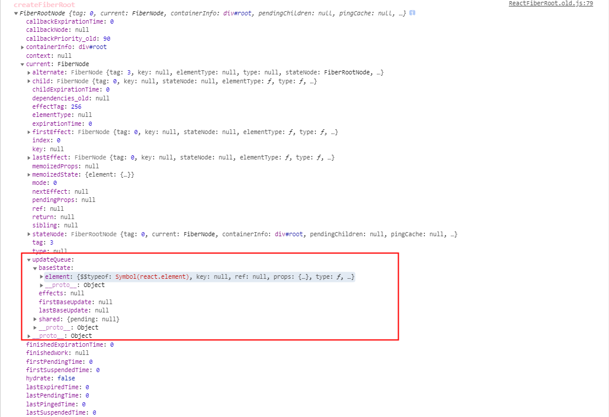

## updateContainer
在legacyRenderSubtreeIntoContainer方法中我们可以看到调用了updateContainer，接下来就看看updateContainer做了什么
### 代码
1. updateContainer核心任务就是创建了一个更新任务对象，初始化时updateContainer会为初始化创建一个任务放入任务队列，浏览器在空闲时候执行这个任务；
```
/**
 * 计算任务的过期时间
 * 再根据任务过期时间创建 Update 任务
 * 通过任务的过期时间还可以计算出任务的优先级
 */
export function updateContainer(
  element: ReactNodeList,
  container: OpaqueRoot,
  parentComponent: ?React$Component<any, any>,
  callback: ?Function,
): ExpirationTime {
  // 这里在初次渲染时 element是children container是fiber root parentComponent是null
  const current = container.current; // current就是RootFiber
  const currentTime = requestCurrentTimeForUpdate(); // 这里得到的是到目前为止 react还能处理多少单位时间(1单位时间是10ms)
  const suspenseConfig = requestCurrentSuspenseConfig(); // 异步加载设置 null
  // 计算过期时间
  // 为防止任务因为优先级的原因一直被打断而未能执行
  // react 会设置一个过期时间, 当时间到了过期时间的时候
  // 如果任务还未执行的话, react 将会强制执行该任务
  // 初始化渲染时, 任务同步执行不涉及被打断的问题
  // 过期时间被设置成了 1073741823, 这个数值表示当前任务为同步任务
  const expirationTime = computeExpirationForFiber(
    currentTime,
    current,
    suspenseConfig,
  );

  const update = createUpdate(expirationTime, suspenseConfig); // update是react中用来标记应用要更新的地点
  // 将要更新的内容挂载到更新对象中的 payload 中
  // 将要更新的组件存储在 payload 对象中, 方便后期获取
  update.payload = {element};

  callback = callback === undefined ? null : callback;
  if (callback !== null) {
    update.callback = callback;
  }

  enqueueUpdate(current, update); // 把update对象加到Fiber对象上对应的updateQueue，一个整体的react应用更新过程中，会有很多次更新在一个节点上
  scheduleWork(current, expirationTime); // 开始进行任务调度，因为有任务优先级的概念，同一时间可能有很多任务在里面，通过这里进行不同优先级调用

  return expirationTime;
}
```
可以看到这个方法在这里创建了一个expirationTime，这个变量在整个更新调度过程中灰常重要，后面在继续详细讲解，同时创造了一个update，同时把update加入到updateQueue
2. 生成update
```
export function createUpdate(
  expirationTime: ExpirationTime,
  suspenseConfig: null | SuspenseConfig,
): Update<*> {
  const update: Update<*> = {
    expirationTime, // 更新过期时间
    suspenseConfig,

    tag: UpdateState, // 4种类型，
    // export const UpdateState = 0; 更新state
    // export const ReplaceState = 1; 替换state
    // export const ForceUpdate = 2; 强制更新state
    // export const CaptureUpdate = 3; 更新错误时捕获
    payload: null, // 实际执行的操作内容，
    callback: null, // 对应回调，蔽日setstate或者render的回调

    next: null, // 下一个update
  };
  return update;
}
```
3. update加入到updateQueue，任务队列中的 shared.pending 属性存储待执行任务，它是一个单向链表结构，它存储一个待执行任务对象，这个任务对象的 next 属性存储下一个任务，以此串联。
```
export function enqueueUpdate<State>(fiber: Fiber, update: Update<State>) {
  const updateQueue = fiber.updateQueue; // 获取当前 Fiber 的 更新队列
   // 如果更新队列不存在 就返回 null
  if (updateQueue === null) {
    // Only occurs if the fiber has been unmounted.
    return;
  }
  // 获取待执行的 Update 任务
  // 初始渲染时没有待执行的任务
  const sharedQueue: SharedQueue<State> = (updateQueue: any).shared;
  const pending = sharedQueue.pending; // pending 存储的是待执行的任务
  // 如果没有待执行的 Update 任务
  if (pending === null) {
    update.next = update; // 这是第一次更新, 创建一个循环列表.
  } else {
    update.next = pending.next;
    pending.next = update;
  }
  sharedQueue.pending = update; // 将 Update 任务存储在 pending 属性中
}
```
### 什么是update
1. 用于记录组件状态的改变
2. 存放于Fiber的UpdateQueue中，单向链表结构，一次整体的更新过程中，可能会同时存在多个update
### UpdateQueue
1. 存放update链表


### 总结
updateContainer 主要内容：
- 计算过期时间，初始化渲染是同步任务，固定最大时间
- 设置fiberRoot的context属性，初始化为{}
- 创建一个任务加入任务队列updataQueue.shared.pending
- 调度任务scheduleWork
